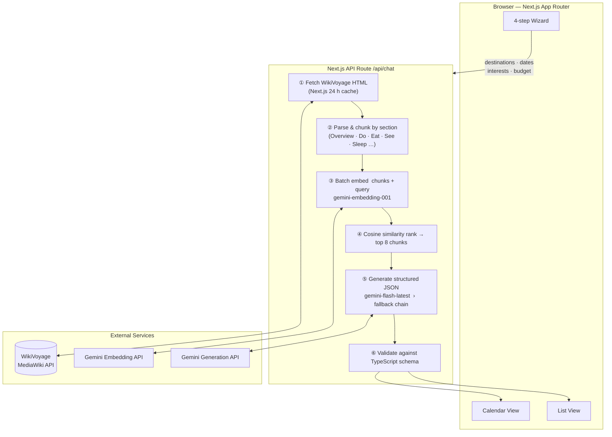

# Next Stop

> AI-powered travel itinerary generator grounded in real destination data.

**Check it out here → [https://travel-planner-umamenon.vercel.app](https://travel-planner-umamenon.vercel.app)**


## Why I Built This

My family planned a trip last year using an AI chatbot, but unfortunately had to come up with a new plan on the spot on Day 2 of the trip.

The issue was that chatbot's plan looked great until we were actually there: a botanical garden listed for Monday was closed on Mondays, a highly rated restaurant didn't exist, a museum with $5 tickets was only $5 for students, and activities on opposite sides of the city were listed back-to-back without consideration of travel time. We didn't expect to have to manually check each item was real, open, and reachable.

Next Stop first asks *you* questions, then fetches live WikiVoyage articles at generation time and uses RAG to ground the itinerary in real destination and activity data. Activities include cost estimates that sum to your daily budget, and the calendar view makes time allocation visible so you can ensure it's your perfect amount of vacation dead time. Multi-destination trips are sequenced to minimize backtracking, and everything exports to your favorite calendar app with timezone-adjusted times.

## Features

- **4-step guided wizard** — destination picker → interests → daily budget → optional notes, with inline validation at each step
- **RAG-grounded itineraries** — every itinerary is anchored to live WikiVoyage articles, not just model priors (see [Architecture](#architecture) below)
- **Multi-destination sequencing** — days distributed proportionally, cities ordered to minimize geographic backtracking
- **Dual itinerary views** — calendar view with color-coded time-of-day events, or a compact list view
- **ICS export** — import your full itinerary, timezone-adjusted, into any calendar app
- **Budget-aware scheduling** — per-activity cost estimates that sum to the stated daily budget

## Architecture



### Data flow

1. User's destinations hit `/api/chat`.
2. Server fetches each destination's WikiVoyage article, parses the HTML into section chunks (Overview, Do, Eat, Sleep, etc.), and caches responses for 24 hours via Next.js `fetch` revalidation.
3. All chunks **plus** the user's query are embedded together in a single batched call to `gemini-embedding-001`.
4. Computes cosine similarity between the query vector and every chunk vector, and the top 8 chunks are then selected.
5. Selected 8 chunks appended to the system prompt as grounded context before generation.
6. `gemini-flash-latest` (currently 3.5-Flash) generates a validated JSON itinerary. If it returns a 503 due to model overload, the server retries with `gemini-flash-lite-latest` (currently 3.1-Flash-Lite).
7. The response is validated against the TypeScript `TravelItinerary` schema before being returned to the client.

### JSON schema

The model is constrained to return only this object:

```ts
{
  summary:     string          // 2-3 sentence trip overview
  totalDays:   number
  dailyBudget: number          // USD per person per day
  days: [{
    date:       string         // YYYY-MM-DD
    location:   string         // City, Country
    timezone:   string         // IANA identifier, e.g. "America/New_York"
    activities: [{
      time:          string    // HH:MM AM/PM
      title:         string
      description:   string
      category:      "history" | "food" | "lifestyle" | "nature" | "other"
      estimatedCost: number    // USD per person
    }]
  }]
  tips: string[]               // 3-5 practical travel tips
}
```

## Tech Stack

| Layer | Technology |
|---|---|
| Framework | Next.js 16 (App Router) |
| Frontend | React 19, TypeScript |
| Styling | Tailwind CSS v4, shadcn/ui |
| Calendar | @calendarjs/ce |
| AI / Embeddings | Google Gemini API (`@google/genai`) |
| Deployment | Vercel |
| Data source | WikiVoyage MediaWiki API |


## Local Setup

```bash
git clone https://github.com/uma-menon/travel-planner
cd travel-planner
npm install
```

Create `.env`:

```env
GEMINI_API_KEY=your_key_here
```

```bash
npm run dev # → http://localhost:3000
```

## Currently working on...

- **Accounts & saved itineraries** — authenticate users and persist generated trips so they can revisit, share, or export them
- **RAG evals** — build an evaluation harness to measure retrieval quality (precision/recall of relevant chunks) and generation quality (factual accuracy, hallucination rate)
- **Map view** — integrate a maps API to render alongside the calendar and list views
